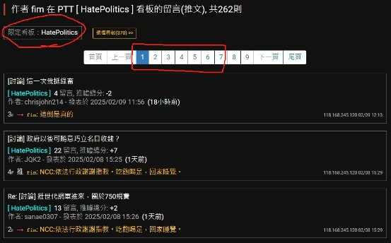
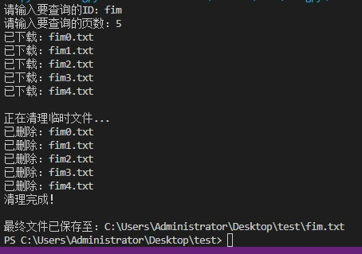
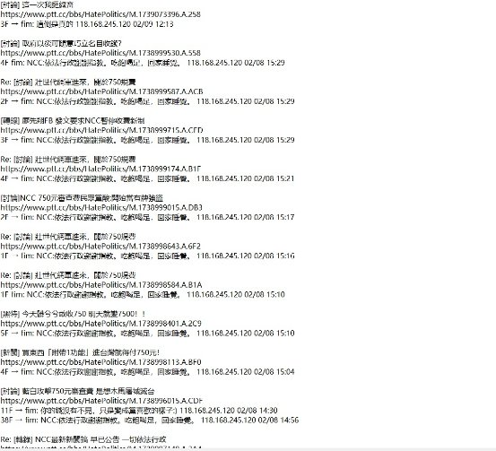

# **政黑4-6小工具(免安裝)**

##### **下載網址(或到右邊Releases)**
<https://github.com/Learn-Long/MyTool/releases/download/v0211/4-6.exe>
##### **使用說明**
1. 先到PTT網頁版 (<https://www.pttweb.cc/user>)，查詢你要檢舉的對象，並將限定看板改成政黑。此處以 fim 這位使用者為例：

   

1. 假設他是從第5頁開始刷推文，就在小工具裡面輸入 fim，4 如下：

   

1. 速度很快，我測試抓自己100頁用不到一分鐘 (一頁都是10篇文章)，結束之後在跟這個小工具同一個資料夾裡面就會出現一個”fim.txt”文件

   

1. 把不要的部份刪去就好，比傳統方式快很多
1. 目前跟政黑版適配度比較高，一切開源歡迎自行修改
